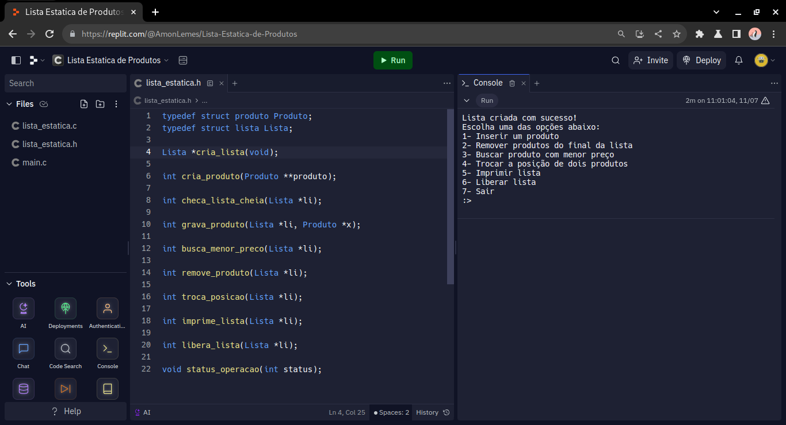

# Lista Estática
#### Lista estática em C para criação, remoção e adição de produtos em uma lista

## Como rodar a TAD 💻
#### Caso você baixe o projeto diretamente do Github, execute os seguintes comandos em seu terminal 
* ### Linux
~~~sh
gcc -o nome_arquivo_de_saída main.c lista_estatica.c
~~~
~~~sh
./nome_arquivo_de_saída
~~~
* ### Windows
~~~sh
gcc -o nome_arquivo_de_saída.exe main.c lista_estatica.c
~~~
#### Você também pode rodar a lista estática pelo seu navegador no Replit:
[Link da Lista Estática](https://replit.com/@AmonLemes/Lista-Estatica-de-Produtos)
 \´