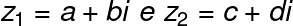
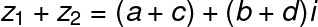
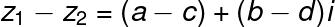
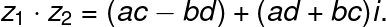
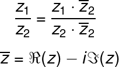
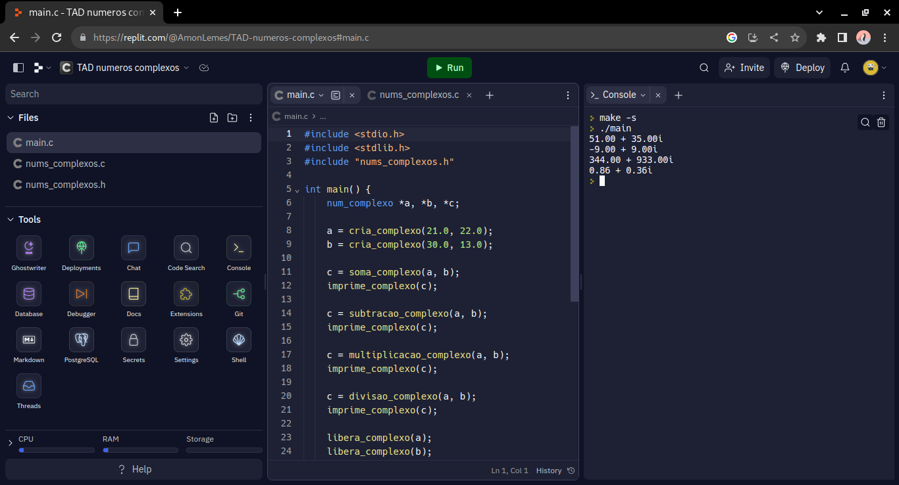

# TAD para operações com números complexos
#### TAD criada para fazer as quatro operações básicas utilizando números complexos.
## As fórmulas:
#### Dados os complexos: 
* Adição 

* Subtração 

* Multiplicação 

* Divisão 
## Como rodar a TAD 💻
#### Caso você baixe o projeto diretamente do Github, execute os seguintes comandos em seu terminal 
* ### Linux
~~~sh
gcc -o nome_arquivo_de_saída main.c nums_complexos.c 
~~~
~~~sh
./nome_arquivo_de_saída
~~~
* ### Windows
~~~sh
gcc -o nome_arquivo_de_saída.exe main.c nums_complexos.c
~~~
#### Você também pode rodar a TAD online pelo Replit pelo link:
[Link da TAD numeros complexos](https://replit.com/@AmonLemes/TAD-numeros-complexos)
 